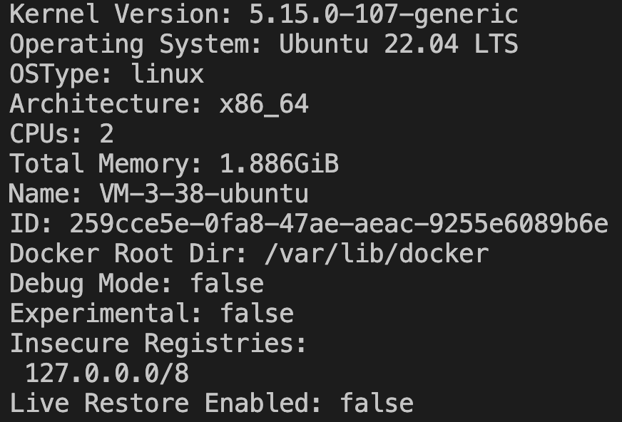

# 云服务器教程

## 服务器安装 Docker 教程链接

详细教程链接：https://cloud.tencent.com/document/product/213/46000#1H-kXbk9zoqvzYMVPVsBO

## 服务器安装 Git 教程

1. VS Code ssh 连接远程服务器
2. 打开终端（快捷键：Ctrl + `）
3. 运行下面的命令

```
sudo apt-get update
sudo apt-get install git
```

## 服务器安装 Docker 教程（国外服务器）

国外服务器可以使用官方一键安装脚本，无需更换软件源。

```bash
curl -fsSL https://get.docker.com | sh
```

## 服务器安装 Docker 教程（适用 Ubuntu 操作系统）

1. 执行以下命令，添加 Docker 软件源。
   ```
   sudo apt-get update
   sudo apt-get install ca-certificates curl -y
   sudo install -m 0755 -d /etc/apt/keyrings
   sudo curl -fsSL https://mirrors.cloud.tencent.com/docker-ce/linux/ubuntu/gpg -o /etc/apt/keyrings/docker.asc
   sudo chmod a+r /etc/apt/keyrings/docker.asc
   echo   "deb [arch=$(dpkg --print-architecture) signed-by=/etc/apt/keyrings/docker.asc] https://mirrors.cloud.tencent.com/docker-ce/linux/ubuntu/ \
   $(. /etc/os-release && echo "$VERSION_CODENAME") stable" |   sudo tee /etc/apt/sources.list.d/docker.list > /dev/null
   sudo apt-get update
   ```
2. 执行以下命令，安装 Docker。
   ```
   sudo apt-get install docker-ce docker-ce-cli containerd.io docker-buildx-plugin docker-compose-plugin
   ```
3. 执行以下命令，运行 Docker。
   ```
   sudo systemctl start docker
   ```
4. 执行以下命令，检查安装结果。
   ```
   sudo docker info
   ```
5. 返回如下信息，即表示安装成功。  
   

## 国内服务器快速配置 Docker 镜像源

适用于大多数已经安装 Docker Engine 的 Linux 服务器。下面命令会自动创建 Docker 配置目录、备份旧配置、写入镜像源站并重启 Docker，整段可以直接复制执行。

```bash
sudo mkdir -p /etc/docker
sudo cp /etc/docker/daemon.json /etc/docker/daemon.json.bak.$(date +%F-%H%M%S) 2>/dev/null || true

sudo tee /etc/docker/daemon.json > /dev/null <<'EOF'
{
  "registry-mirrors": [
    "https://docker.1ms.run",
    "https://dockerproxy.net",
    "https://docker.m.daocloud.io",
    "https://docker.1panel.live"
  ]
}
EOF

sudo systemctl daemon-reload
sudo systemctl restart docker
docker info | grep -A 10 "Registry Mirrors"
```

配置文件路径：`/etc/docker/daemon.json`

已写入的镜像源站：

- `https://docker.1ms.run`
- `https://dockerproxy.net`
- `https://docker.m.daocloud.io`
- `https://docker.1panel.live`

最后一条命令用于检查镜像源是否已经生效。

## 云服务器配置 GitHub SSH 教程

1. 生成 RSA 密钥
   在终端中运行以下命令：
   ```bash
   ssh-keygen -t rsa
   ```
2. 获取 RSA 公钥内容
   ```bash
   cat ~/.ssh/id_rsa.pub
   ```
3. 将公钥配置到 GitHub 上
   1. 登录 GitHub
   2. 点击右上角的头像，选择 Settings
   3. 在左侧菜单中选择 SSH and GPG keys
   4. 点击 New SSH key
   5. 输入 Title 和 Key (粘贴公钥内容)
   6. 点击 Add SSH key
4. 测试 SSH 连接
   在终端中运行以下命令：
   ```bash
   ssh -T git@github.com
   ```

## 云服务器部署仓库教程

1.  fork 仓库并修改相关配置
    1.  fork 仓库
    2.  修改仓库名称为你的项目名称（可选）
    3.  复制打包的文件放到 web 目录下
    4.  修改 yourdomain.com 为你的域名
        1.  在 Caddyfile 中修改 yourdomain.com 为你的域名
        2.  在 docker-compose.yml 中修改 yourdomain.com 为你的域名
    5.  配置 Caddyfile 中的路由规则
        1.  把 Caddyfile 中的 path/ 改为你的 URL 路径
2.  登录云服务器
    1.  VS Code 下载插件 Remote - SSH
    2.  ssh 连接服务器（请参考 VS Code 教程）
    3.  安装 docker（请参考 Docker 教程）
    4.  配置 docker 镜像加速（请参考本文档“国内服务器快速配置 Docker 镜像源”）
    5.  安装 git（请参考 VS Code 教程）
3.  拉取远程仓库

    1. git 连接远程仓库

       1. 在服务器生成 SSH 秘钥
          - 单个仓库使用默认密钥:  
            `ssh-keygen -t ed25519 -C "your_email@example.com"`
          - 多个仓库需要为每个仓库生成独立密钥:  
            `ssh-keygen -t ed25519 -C "your_email@example.com" -f ~/.ssh/id_ed25519_repo1`  
            `ssh-keygen -t ed25519 -C "your_email@example.com" -f ~/.ssh/id_ed25519_repo2`  
            (直接按 3 次 Enter 使用默认设置)
       2. 查看并复制公钥
          - 默认公钥: `cat ~/.ssh/id_ed25519.pub`
          - 特定仓库公钥: `cat ~/.ssh/id_ed25519_repo1.pub`
            复制输出的全部内容
       3. 在 GitHub 中为每个仓库添加 Deploy keys
          1. 登录 GitHub
          2. 进入仓库，选择 Settings
          3. 点击 Deploy keys
          4. 点击 Add deploy key
          5. 输入 Title 和 Key (使用对应仓库的公钥)
          6. 点击 Add key
       4. 配置 SSH 以使用不同的密钥访问不同仓库

          1. 创建或编辑 SSH 配置文件: `nano ~/.ssh/config`
          2. 添加如下配置:

             ```
             # 默认 GitHub 配置
             Host github.com
                 HostName github.com
                 User git
                 IdentityFile ~/.ssh/id_ed25519

             # 第一个仓库的配置
             Host github-repo1 # 自定义别名（用于git命令:例如：git@github.com-feisai-tech-main，或者git clone git@github.com-feisai-tech-website:feisai-tech/feisai-tech-website.git）
                 HostName github.com
                 User git
                 IdentityFile ~/.ssh/id_ed25519_repo1

             # 第二个仓库的配置
             Host github-repo2
                 HostName github.com
                 User git
                 IdentityFile ~/.ssh/id_ed25519_repo2
             ```

          3. 保存并退出 (Ctrl+O, Enter, Ctrl+X)

       5. 测试各个仓库的连接
          - 测试默认连接: `ssh -T git@github.com`
          - 测试特定仓库: `ssh -T git@github.com-repo1`
            输入 yes 回车
            看到`Hi yourusername! You've successfully authenticated`表示成功

    2. git clone 远程仓库
       - 使用默认密钥: `git clone git@github.com:yourusername/yourrepo.git`
       - 使用特定仓库密钥: `git clone git@github.com-repo1:yourusername/repo1.git`

4.  运行 docker 脚本
    1.  从终端 cd 到仓库目录
    2.  构建镜像并运行 `sudo docker-compose up -d`
5.  访问 URL 地址
    1.  打开浏览器
    2.  输入正确的 URL `https://yourdomain.com/path/`
    3.  应该可以看到你的网页了

## 可能遇到的问题

1.  端口冲突  
    报错：failed to bind host port for 0.0.0.0:80:172.18.0.2:80/tcp: address already in use
    1.  查看端口占用情况 `sudo lsof -i :80`
    2.  如果看到类似这样的输出：
        ```
        nginx    1234    root    6u  IPv4  12345      0t0  TCP *:80 (LISTEN)
        ```
    3.  关闭端口 `sudo systemctl stop nginx`
    4.  重新运行 docker 脚本
2.  配置镜像加速错误
    1.  检查配置文件是否正确 `sudo cat /etc/docker/daemon.json`
        应该显示类似：
        ```
        {
          "registry-mirrors": [
            "https://docker.1ms.run",
            "https://dockerproxy.net",
            "https://docker.m.daocloud.io",
            "https://docker.1panel.live"
          ]
        }
        ```
    2.  如果配置不正确，直接重新执行上面的“国内服务器快速配置 Docker 镜像源”命令即可
    3.  重新运行 docker 脚本
3.  远程仓库更新了如何重启 docker？
    1.  cd 到仓库目录
    2.  git pull 更新代码
    3.  sudo docker-compose down 停止容器
    4.  sudo docker-compose up -d 启动容器


---

> 整理：**FEISAI** · [CC BY-SA 4.0](https://creativecommons.org/licenses/by-sa/4.0/deed.zh-hans)。原作者、原文链接与修改说明见 [Sources](/sources)。
