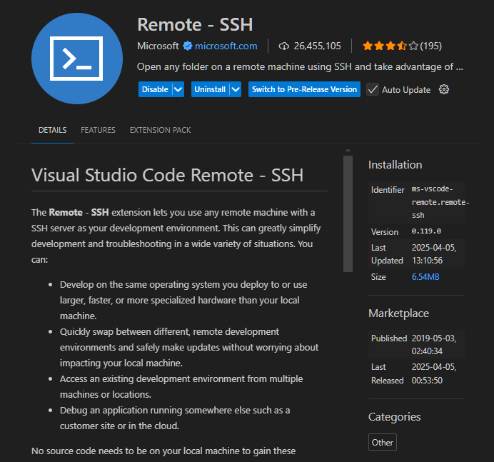
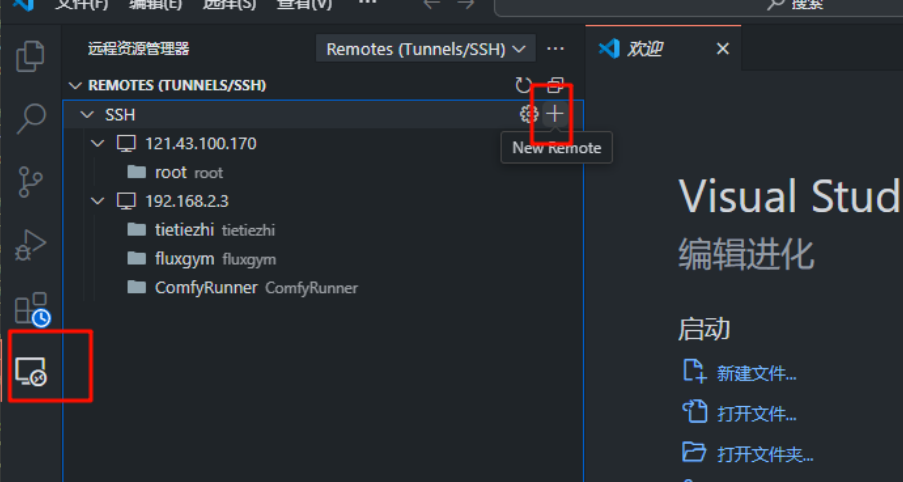
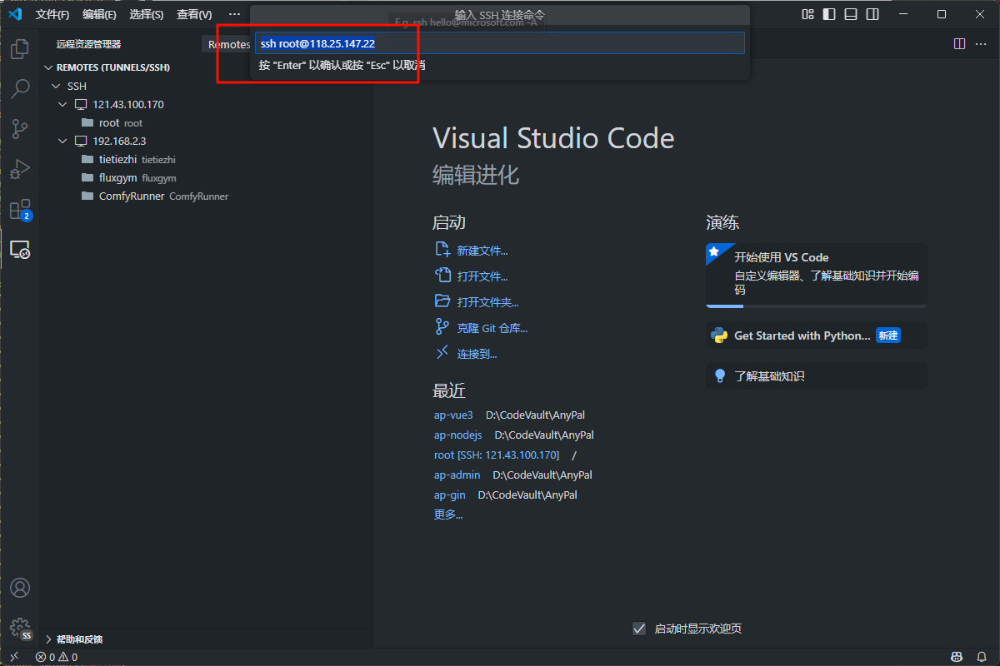
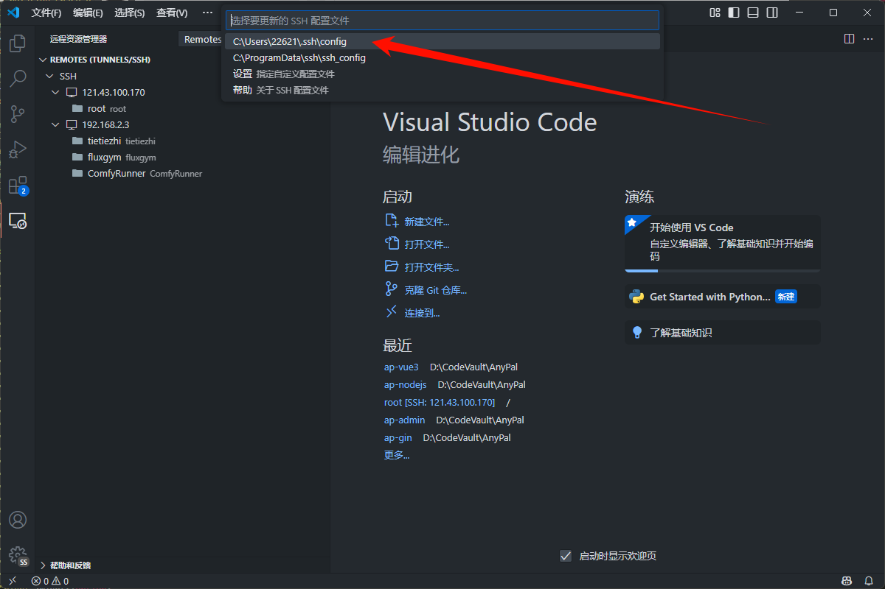

# VS Code 教程

# 基础配置

## Git

### 更改生成 commit 提交信息的提示词

1. 快捷键 `Ctrl + Shift + P` 打开命令面板
2. 输入 `Preferences: Open User Settings (JSON)` 并回车
3. 在配置中添加下面的提示词内容
   ```json
    "github.copilot.chat.commitMessageGeneration.instructions": [
    {
      "text": "请始终使用简体中文生成 Git 提交信息，格式采用约定式提交（feat/fix/docs/refactor/chore），不要输出英文。"
    }],
   ```

## 推荐插件

## VS Code 连接远程服务器教程

1. 下载 SSH 远程连接插件
   
2. 添加远程服务器
   
3. 输入服务器公网 IP
   
4. 选择 SSH 配置文件位置，可以保存在本地
   

# Cursor 教程

## 如何重置 cursor 的使用期限

免费使用 Cursor Pro：[点击获取](https://github.com/yuaotian/go-cursor-help)

## Trae 教程


---

> 整理：**FEISAI** · [CC BY-SA 4.0](https://creativecommons.org/licenses/by-sa/4.0/deed.zh-hans)。原作者、原文链接与修改说明见 [Sources](/sources)。
